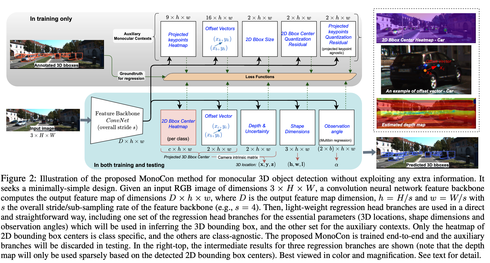
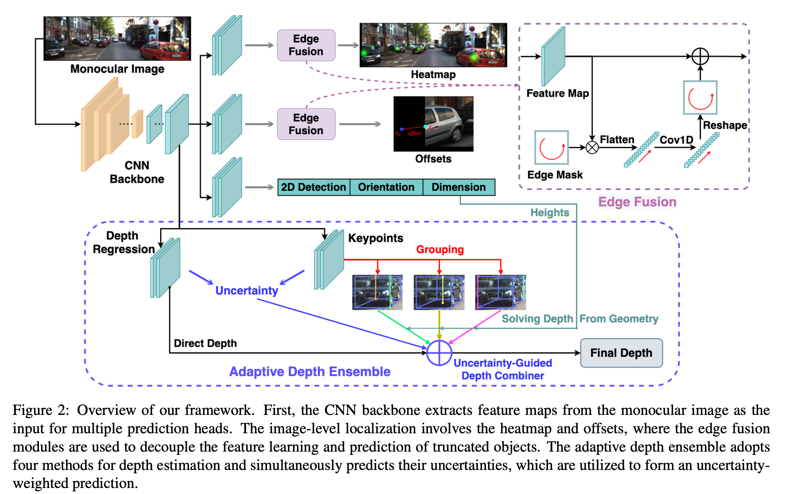

# Literature Review

## 1. Monocular 3D Detection with Geometric Constraints Embedding and Semi-supervised Training Embedding and Semi-Supervised Training [[Link]](https://arxiv.org/abs/2009.00764)

Object detection in 3D essentially concerns with finding all the instances of a set of classes in a given image, represented by a 3D bounding box. A 3D bounding box consists of 8 corners. In this work, they also consider the center of the bounding box, and refer to the projection of these 9 3D points onto the 2D image plane ( 8 corners + 1 centre ) as **keypoints**. Now, the goal is to predict these keypoints for every object in a given an RGB image from a single camera. 

Question : In how many ways can we make this happen? 

As it turns out, there are more than one ways to obtain these keypoints :
1. Let us first discuss the most obvious approach. Given a set of training images with keypoints (8 corners and 1 centre ) as labels, we simply train a network to predict all the 9 values. During inference, just with the given input image, the network gives out the 9 keypoints. 
2. A more involved approach is to use perspective geometry. In perspective geometry, if the 3D position ( of the centre of the 3D bounding box in global frame) , dimensions ( height, width, length) and orientation ( yaw, pitch, roll ) is given,  one can obtain the keypoints using projective transformations. But how do we obtain the dimension, orientation and position? The dimension and orientation can be predicted using CNN. And how do we find the position, given the predicted orientation and dimension.

Here is where the essensce of approach proposed by the paper comes into play. Since we have two different ways to obtain the same keypoints, we can minimize the difference between these two sets of keypoints by optimizing over the 3D position. The approach leverages the best parts from both CNN and perspective geometry in an intuitive and end-to-end differentiable ( hence trainable ) network to formulate a unified approach for 3D object detection from monocular images. 

### Method
The architecture consists of two main modules. The first module is a fully connected CNN, which extracts features from the input image. 
These features are further used across multiple heads for predicting appearance-related properties of an object namely dimension, orientation and ordered list of 2D perspective keypoints. The second module is for geometric reasoning which applies point-to-point geometric constraints for 3D position prediction. Now let us understand at each component in some more detail :

### Detection Heads 
1. Main Centre 
  * Predicts the 2D bounding box center of every object. One point per instance.
  * The prediction is a heatmap around the centers, with one channel for every category. 
2. Keypoints 
  * Projections of 3D corners and centers onto the 2D image plane. ( 8 corners + 1 center = 9 points )
  * 18 dimensional because each of the 9 points ( x, y ) is 2 dimensional.
3. Dimensions
  * Height, Width and Length
  * Regression of residual values instead of absolute values
  * Scaled by constants H = 1.63, W = 1.53, L = 3.88

## 2.  MonoCon : Learning Auxiliary Monocular Contexts Helps Monocular 3D Object Detection [[Link]](https://arxiv.org/abs/2112.04628)

The method trains a common CNN based feature backbone for a primary task and a set of auxillary tasks. The primary task is trained to predict the 2D bounding box center, offset vector ( from 2D center to 3D center ), depth, shape and observation angle ( angle of object from camera ). During inference, the 2D bbox cente, along with depth is used to extract the 3D bbox center using Intrinsic Camera Matrix (K). Auxillary tasks are defined with the goal of providing monocular context to the model. In principal, the auxillary tasks are not used in inference, but are only used during training to assist the primary tasks in getting monocular context. Specifically, the auxillary tasks include prediction of projected keypoints, offset vector ( of 2D center to 9 keypoints ), 2D bounding box shape, 2D bounding box center quantization residual, projected keypoints quantization residual. Five varieties of losses are used for various outputs. In particular, the Gaussian Kernel Weighted Focal Loss is used for all heatmaps based outputs ( like Centernet ). The laplacian aleatoric uncertianity loss function is used for depth prediciton. The dimension aware L1 loss is used for shape prediction ( h,w,l ). Cross-Entropy loss is used for bin index in observation angle. Standard L1 Loss function is used for all offset vectors, residual of angle, and quantization residual. Finally, all these losses are combined by summation. 

## 3. MonoFlex : Objects are Different: Flexible Monocular 3D Object Detection [[Link]](https://arxiv.org/abs/2104.02323)
The paper deals with Monocular 3D object detection for truncated objects by explicitly modeling objects that are inside and outside the image. The objects are divided into inside and outside based on whther the projected 3D center are inside or outisde the image. For objects with their projected 3D centers inside the image, the center is direcly regressed. In contrary, when the projected center lies outside the image, the intersection between image edge and line connecting 2D bbox and 3D bbox center is used. The offset of this intersection point to the center of the object is predicted. The loss functions used are penalty reduced focal loss for heatmap, L1-loss and log-scale L1 loss for regressing inside and outside points respectively. For dimension estimation, classwise adaptable training is used. In particular, the average per category is computed after which, the offset to this statstical average is predicted. For orientation estimation, the Multi-Bin loss is used, which divides the range in N overlapping bins. The model uses L1 loss for keypoint estimation, with 10 keypoints consisting of 8 corners, and 2 top and bottom centers. For depth estimation, the model uses ensemble learning by creating an ensemble of (M+1) estimators, with M geometric solutions and 1 direct regression. For direct regresssion , the inverse sigmoid transformation is applied to network output and L1 loss is applied with ground truth depth. For the remaining M geometry based solutions, the focal length is used with pixel height and object height to obtain object depth. The keypoints of the center verticle is exactly object depth. While averaging depoths of two diagonal vertical edges can also give object depth. Thus, these 10 keypoints are divided into three groups to get independent depths.  Finally the predicted depths with their associated uncertainities are used to obained uncertainity guided ensemble. 

## 4. GUPNet : Geometry Uncertainty Projection Network for Monocular 3D Object Detection
Geometric Projection refers to the process of deriving depth using 2D height, 3D Height and focal length. The key challenge of using geometric projections is error amplification. When there is a small error in the 3D height, it is amplified when this 3D height is used to derive depth. The error amplification is tackled using a GUP module to obtained the Geometry guided uncertainity of the inferred depth. Instead of discrete values, this model returns a distribuion of the depth, which helps to measure the quality of the depth predicitons using inference. Furthermore, another challenge faced by such a model is that of training instability due to initial wrong estimates of the 3D height ( hence depth ). In simple words, if the initial predicted 2D and 3D height values by the model are that of bad quality ( which they generally are ), the overall training is mislead, and the performance is damaged.  Heirarchical Task Learning strategy is used during training to tackle this problem. Intuitively, HLT is inspired by how humans learn new things, by first learning the basics well, and then learn the advanced tasks ( dependent on these basics ). To that end, the model divides all losses into several stages and only when all the tasks of a previous stage are learnt well enough, the subsequent tasks start learning. In particular, 
